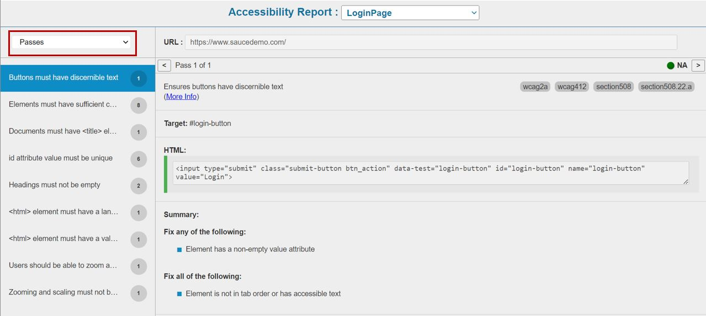

# **Accessibility Testing**
---------------------------------
The tool uses **`aXe`** as a library to test the accessibiity aspects of a website or specific elements.
This feature comes packed into 2 simple actions having all the **WCAG** standards baked-in, thereby making execution very easy and report analysis easier.  
However at any point in time we can include/exclude specific tags during the testing.

--------------------------------------

## Actions

### **testAccessibility**

**Description**: This function will generate the accessibility report for the entire web
page based on the input parameters passed, Report name is mandatory under the
input.

**Usage:**

| ObjectName  | Action              | Input                                         | Condition |Reference|
|-------------|----------------------|-----------------------------------------------|-----------|---------|
| Browser     |*testAccessibility*   | @ReportName                                   |           |         |
| Browser     |*testAccessibility*   | @ReportName @include tagName                  |           |         |
| Browser     |*testAccessibility*   | @ReportName @exclude tagName                  |           |         |
| Browser     |*testAccessibility*   | @ReportName @include tagName @exclude tagName |           |         |
| Browser     |*testAccessibility*   | @ReportName @Options{}                        |           |         |


Inputs in the Input column can be either **hardcoded** (in this case the data is preceded by a "**@**"), passed from the data sheet (**datasheet name : column name**) or passed from a variable value (**%variable name%**).

**Internally Uses**
```javascript
axe.a11yCheck(arguments[0], %s, arguments[arguments.length - 1]);
```
-------------------------------------------
### **testAccessibilityElement**

**Description**: This function will generate the accessibility report for a particular web
element based on the input parameters passed. The input parameters are optional.
In case no input parameter is passed the report will be generated for all tags associated with the element, the default name for the report will be the name of the
element.

**Usage:**

| ObjectName  | Action              | Input                                         | Condition |Reference|
|-------------|----------------------|-----------------------------------------------|-----------|---------|
| WebObject   |*testAccessibilityElement*|@ReportName                                   |           |         |
| WebObject   |*testAccessibilityElement*   | @ReportName @Options{}                  |           |         |

**Internally Uses**
```javascript
axe.a11yCheck(arguments[0], %s, arguments[arguments.length - 1]);
```

------------------------------------------

## Example

Here is an example of how to test the accessibility of all elements in a page.

* In the tool, the command is as follows :

 

* On running this, a report will be generated which will have the **[axe]** icon as shown below.


* On clicking this **[axe]** icon, the Accessibility Test report will open up which will show all the **Passes** as below :



* The report will also show all the **Violations** like this :


* In the above example the Report failed as it had the following **Violations** as seen in the report :

    * aria-label attribute does not exist or is empty
    * aria-labelledby attribute does not exist, references elements that do not exist or references elements that are empty or not visible
    * Form element does not have an implicit (wrapped) **`<label>`**
    * Form element does not have an explicit **`<label>`**
    * Element has no title attribute or the title attribute is empty

* The report also provides [this link](https://dequeuniversity.com/rules/axe/2.1/label?application=axeAPI) for reference, under the [More Info] section.   