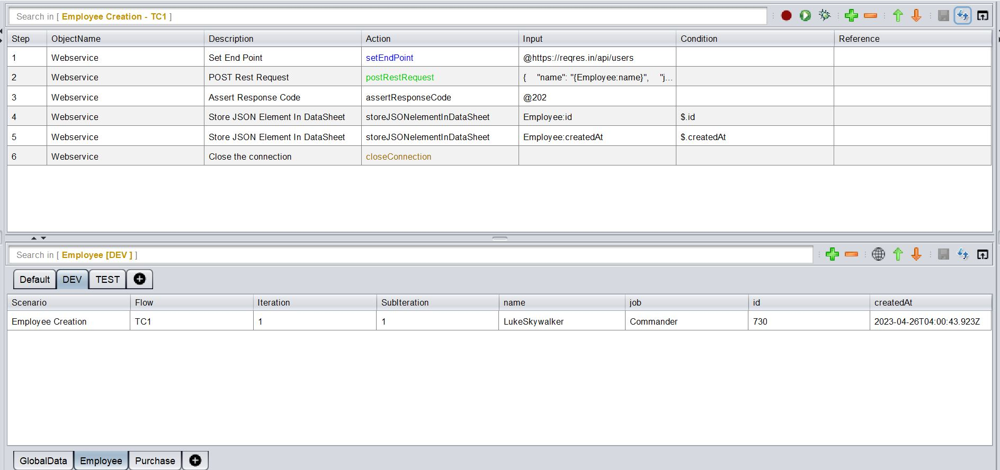

# **API Testing**
-----------------------------

<span style="color:Green">API Testing is one of the strong suites of the tool. It allows us to fire requests, receive responses, validate the response status, response body and response tags.</span>

<span style="color:Green">It also allows us to store response tags which can be used for subsequent API calls or GUI flows. This makes API Testing and GUI Testing possible in a single flow coherently.</span>

-----------------------------------

## How to create an API Test Case?

* A request should contain a **`setEndPoint`** action. This action is always marked in <span style="color:Blue">**Blue.**</span> This is where you put the endpoint to which the request is supposed to be fired. This action comes with an editor for convenience of data set up.

* You can have steps to add headers/authentication etc. (if required)

* A request should contain an **HTTP Method/Verb** (`Post`/`Put`/`Get`/`Delete`/`Patch`) . This action is always marked in <span style="color:Green">**Green.**</span> This also comes with an editor for convenience.

* You can have steps to validate/store response **status codes**, **specific tags** or even the **entire response body.**

* A request should contain a **`closeConnection`** action. This action is always marked in <span style="color:Brown">**Brown.**</span>

 

 The above is an example of a **`postRestRequest`** and then **`assertResponseCode`** followed by **`storeJSONelementInDataSheet`**

-------------------------------------

## Payload Data Parameterization

 Data Parameterization can be done using the built-in **editor.** If you mouse-hover on the **Input** column, corresponding to the **`Post`**/**`Put`** request steps as well as the **`setEndPoint`** step, an option to open up the Editor comes up.

 Inside this editor, we can paste the entire Payload and then parameterize the specific JSON/XML tags based on our needs.

 If we press <span style="color:Red">**[ctrl] + [SPACE]**</span>, the list of all available **DataSheets : ColumnNames** along with all **user-defined variables** show up. We can then select the appropriate item from where we want to parameterize.

 We need to press <span style="color:Red">**[esc]**</span> to close the editor

 
 <span style="color:Red">*The above image is a gif. So if its not moving, please reload the page*</span>

 -------------------------------------

## Assert/Store Response Tags

 We can access the Response Tags using **`xpath`** for XMLs and **`jsonPath`** for JSONs.

 The corresponding **`xpath`** or **`jsonPath`** for the tag, should be entered in the **Condition** column like as shown below :

 

Example of writing an Xpath :

```xml
<root xmlns:foo="http://www.foo.org/" xmlns:bar="http://www.bar.org">
	<actors>
		<actor id="1">Christian Bale</actor>
		<actor id="2">Liam Neeson</actor>
		<actor id="3">Michael Caine</actor>
	</actors>
</root>
```

XPath for retrieving **Liam Neeson** is `/root/actors/actor[2]/text()` or simply `//actor[2]/text()`

Example of writing a JSONPath :

**Example 1 :**

```json
{ 
   "name":"TestName",
   "salary":"12300",
   "age":"29"
}
```

JSON Path for retrieving **TestName** is `$.name` 

**Example 2 :**

```json
{
    "page": 2,
    "per_page": 6,
    "total": 12,
    "total_pages": 2,
    "data": [
        {
            "id": 7,
            "email": "michael.lawson@ing.com",
            "first_name": "Michael",
            "last_name": "Lawson"
        },
        {
            "id": 8,
            "email": "lindsay.ferguson@ing.com",
            "first_name": "Lindsay",
            "last_name": "Ferguson"
        },
        {
            "id": 9,
            "email": "tobias.funke@ing.com",
            "first_name": "Tobias",
            "last_name": "Funke"
        },
        {
            "id": 10,
            "email": "byron.fields@ing.com",
            "first_name": "Byron",
            "last_name": "Fields"
        },
        {
            "id": 11,
            "email": "george.edwards@ing.com",
            "first_name": "George",
            "last_name": "Edwards"
        },
        {
            "id": 12,
            "email": "rachel.howell@ing.com",
            "first_name": "Rachel",
            "last_name": "Howell"
        }
    ],
    "additional": {
        "url": "https://ing.com",
        "text": "Happy Testing!"
    }
}
```

JSON Path for retrieving **byron.fields@ing.com** is `$.data[3].email` [Index starts with 0]

To learn more about JSONPath visit this [GitHub](https://github.com/json-path/JsonPath) page.

-------------------------------------

## Actions

 There are **19** built-in Actions. 

<span style="color:Red">**Please click the action-cloud below to check the details**</span>

 [](apiActions/webservice.md)