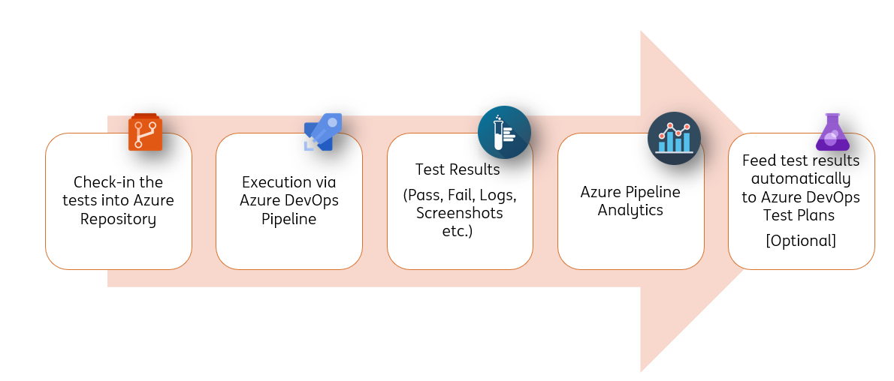
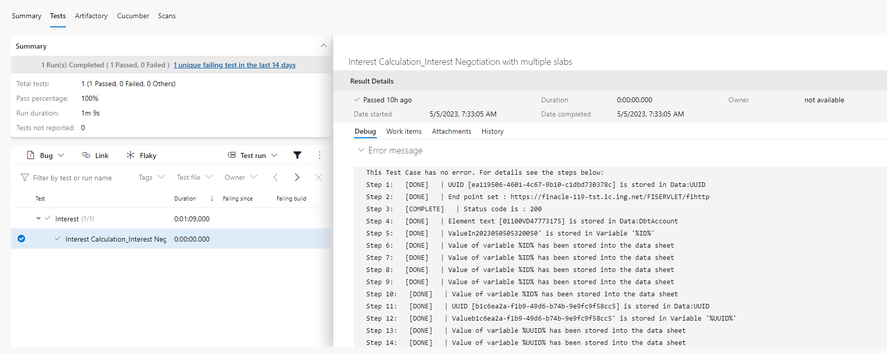
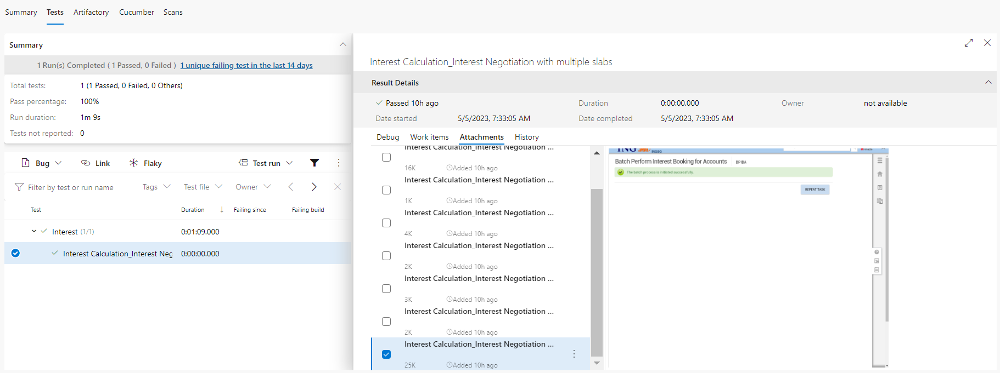
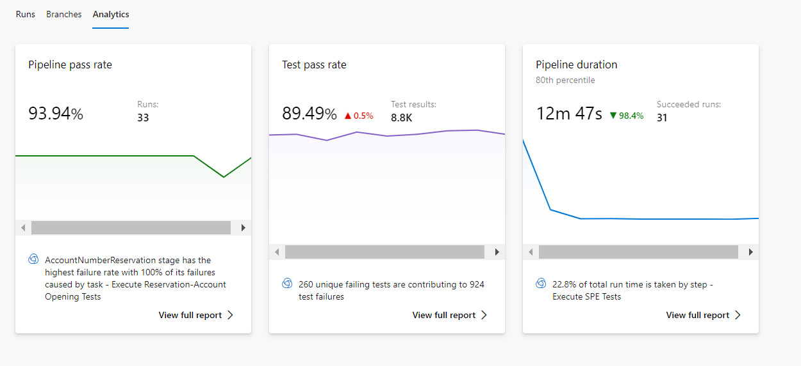

# **Azure DevOps Integration**  
-----------------------------------
Integration with Azure DevOps involves the following points :

* **Check-in the tests into Azure Repository**. Here we need to understand which are the files that need to go into Azure Repo.
* Execution of tests via **Azure DevOps Pipeline**.
* Viewing of **Test Results** (Pass, Fail, Logs, Screenshots etc.) in Azure DevOps itself
* **Analysis** of Historical Results via Azure Analytics
* Feed test results automatically to **Azure DevOps Test Plans** [Optional]

 

-------------------------------------

## **Azure DevOps Repository**

### Simple way - Libraries pushed to Azure Repository.

The `.gitignore` file content should be as shown below. Every other file should be pushed to the Repository.

```
LICENSE
Extensions/
GridNode/
Jenkins/
logs/
Projects/*/Results/*/
Projects/*/*/Results/*/
web/
recent.items
log.txt
Tools/
```

### Advanced way - Libraries pushed to Azure Artifacts.[Recommended] 

The `lib` and the `*.jar` are the 2 additions in this case. These `jars` should be pushed to Azure Artifacts instead of Repositories.

```gitignore
LICENSE
Extensions/
GridNode/
Jenkins/
logs/
Projects/*/Results/*/
Projects/*/*/Results/*/
web/
recent.items
log.txt
MT_Messages/
Tools/
lib/
*.jar
```

**Steps to publish artifact from working location to Azure Artifacts:**


 * Create a zip of the `lib` folder.
 * Generate a PAT from Azure DevOps Portal following [this.](https://docs.microsoft.com/en-us/azure/devops/organizations/accounts/use-personal-access-tokens-to-authenticate?view=azure-devops&tabs=Windows) If you already have a PAT, you can reuse it.
 * Open `cmd` terminal and execute the following commands :
  
  ``` shell
  SET AZDO_ARTIFACTTOOL_PAT=<Your Personal Access Token>
  <Your Location>\ArtifactTool\artifacttool.exe universal publish --service https://dev.azure.com/INGCDaaS/ --patvar AZDO_ARTIFACTTOOL_PAT --feed PXXXXX-incoming-feed-name --project IngOne --package-name lib --package-version <version> --path <Your Location>\lib.zip
  ```
Repeat the process for the `ide.jar`

----------------------------------------------

## **Azure DevOps Pipeline**

### Simple way - Libraries pulled in from Azure Repository.

The `yaml` file content should be as shown below.

```yaml
pool:
  name: 'CDaaSLinux'
    
stages :
  - stage: TestExecution
    jobs :
     - job :  TestExecution
       steps:    
          - checkout:  self
            fetchDepth: 1
            clean: true  

          # This is to set Java 11
          - script: |
              echo "##vso[task.setvariable variable=JAVA_HOME]$(JAVA_HOME_11_X64)"
              echo "##vso[task.setvariable variable=PATH]$(JAVA_HOME_11_X64)/bin:$(PATH)"
            displayName: "Set java version to 11"  
          
          # This is to set Permissions
          - task: CmdLine@2
            inputs:
              script: 'chmod -R 755 ./'
            displayName: 'Set Permissions'          
          
          # This is to trigger execution
          - task: CmdLine@2
            inputs:
              script: './Run.command -run -project_location "Projects/<your_project_name>" -release "<your_release_name>" -testset "<your_testset_name>" -setEnv "run.AzureReport=true"'
              workingDirectory: '$(System.DefaultWorkingDirectory)'
            displayName: 'Execute Tests'
            
          # This is to publish test results  
          - task: PublishTestResults@2
            inputs:
              testResultsFormat: 'NUnit'
              testResultsFiles: 'Projects/<your_project_name>/Results/TestExecution/<your_release_name>/<your_testset_name>/Latest/azure.xml'
              testRunTitle: 'Test Results'  
```

### Advanced way - Libraries pulled in from Azure Artifacts.[Recommended]

The `yaml` file content should be as shown below.

```yaml
pool:
  name: 'CDaaSLinux'
    
stages :
  - stage: TestExecution
    jobs :
     - job :  TestExecution
       steps:    
          - checkout:  self
            fetchDepth: 1
            clean: true  

          # This is to set Java 11
          - script: |
              echo "##vso[task.setvariable variable=JAVA_HOME]$(JAVA_HOME_11_X64)"
              echo "##vso[task.setvariable variable=PATH]$(JAVA_HOME_11_X64)/bin:$(PATH)"
            displayName: "Set java version to 11"  
          
          # This is to set Permissions
          - task: CmdLine@2
            inputs:
              script: 'chmod -R 755 ./'
            displayName: 'Set Permissions'       
            
          # This is to download the ide jar from Artifacts 
          - task: UniversalPackages@0
            inputs:
                command: 'download'
                downloadDirectory: '$(System.DefaultWorkingDirectory)'
                feedsToUse: 'internal'
                vstsFeed: '<your_feed_uuid>'
                vstsFeedPackage: '<your_pacakage_feed_uuid>'
                vstsPackageVersion: '*'
            displayName: 'Download main jar'

          # This is to download the lib.zip from Artifacts
          - task: UniversalPackages@0
            inputs:
                command: 'download'
                downloadDirectory: '$(System.DefaultWorkingDirectory)'
                feedsToUse: 'internal'
                vstsFeed: '<your_feed_uuid>'
                vstsFeedPackage: '<your_pacakage_feed_uuid>'
                vstsPackageVersion: '*'
            displayName: 'Download supporting libraries zip'

          # This is to unzip the lib.zip
          - task: CmdLine@2
            inputs:
                script: 'unzip lib.zip'
                workingDirectory: '$(System.DefaultWorkingDirectory)'
            displayName: 'Unzip supporting libraries'   
          
          # This is to trigger execution
          - task: CmdLine@2
            inputs:
              script: './Run.command -run -project_location "Projects/<your_project_name>" -release "<your_release_name>" -testset "<your_testset_name>" -setEnv "run.AzureReport=true"'
              workingDirectory: '$(System.DefaultWorkingDirectory)'
            displayName: 'Execute Tests'
            
          # This is to publish test results  
          - task: PublishTestResults@2
            inputs:
              testResultsFormat: 'NUnit'
              testResultsFiles: 'Projects/<your_project_name>/Results/TestExecution/<your_release_name>/<your_testset_name>/Latest/azure.xml'
              testRunTitle: 'Test Results'
```

-------------------------------------

## **Test Results**

To view the Test Results we need to navigate to the **`Tests`** tab of the Azure DevOps Pipeline.

 

If we click on the **`Tests`** we will see the detailed steps of execution under **Debug** Window.

  

If we have **`API Tests`** we will see the request/response payloads in the  **Attachment** Window.  

  

If we have **`Browser Tests`** we will see the screenshots in the  **Attachment** Window. 

  

 -------------------------------------

## **Pipeline Analytics** 

If we click on the `Pipeline Name` and navigate to the **`Analytics`** tab of the Azure DevOps Pipeline, we will see the report like this :

  

We can use this feature to determine the health of the pipeline and analysis of historical test reports.

 -------------------------------------

## **AzureDevOps Test Plan** 

**Content Coming Soon**