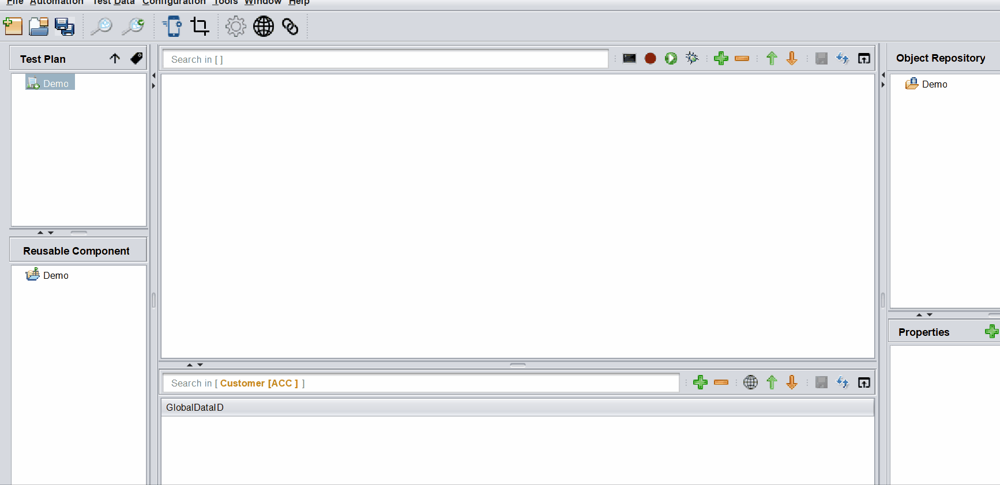
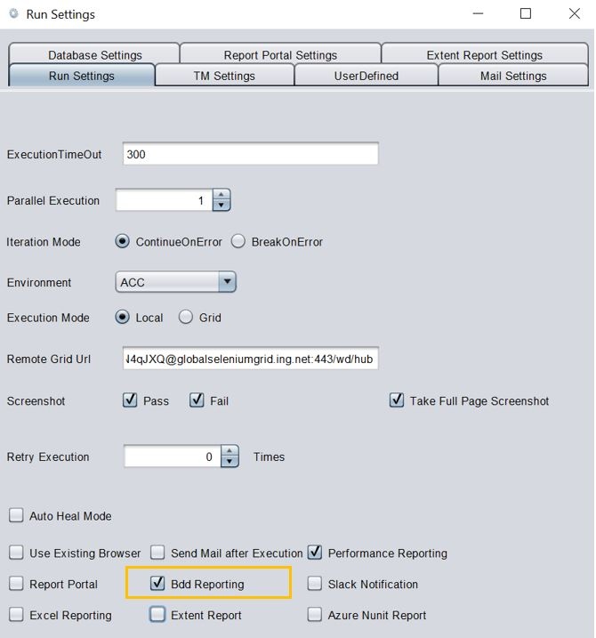
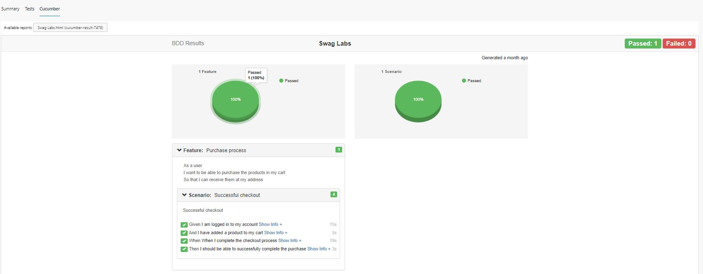

# **Behavior Driven Development (BDD)** 
-------------------------------------------

## Importance of BDD Way of Working

BDD is an Agile software development methodology in which an application is documented and designed around the behavior a user expects to experience when interacting with it. By encouraging developers to focus only on the requested behaviors of an app or program, BDD helps to avoid bloat, excessive code, unnecessary features or lack of focus.

---------------------------------------------- 

## BDD Editor

The tool comes with a BDD editor that lets user to **create/edit** feature files. These feature files can then be imported/converted into automation test cases. The **BDD editor** has a provision of auto suggesting the keywords that can be used while writing feature files. Perform **Ctrl+Space** anywhere in the BDD editor workspace to get the list of keywords supported by the BDD editor.

---------------------------------------------- 

## Create/Edit Feature Files With BDD Editor

 * From the tool UI, navigate to **Tools->BDD->Open Feature Editor** and the editor opens in a new window

 * Create a new project by clicking on **New Project** option, you can also open an existing project **(This is a Mandatory step)**

 * Create a **new story** by clicking on **[+]** icon. A story is basically a feature for which `Scenarios` need to be written.

 * After designing the `features` and `scenarios`, each story can be exported as a **`feature file`** , by clicking on **up arrow**

 


**Note:** Projects created from BDD editor are saved as **json** files and internally **Gherkin** language is used to create feature files.

        
It is also possible to open an existing feature file in the BDD editor using the **down arrow** icon and edit the same and save.

----------------------------------------------        

## Import A Feature File To Create Automation Test Case Scaffolding

In order to translate the feature files into an automation scenario, follow the steps below :

 * Navigate to **Tools->BDD->Import Feature file**

 * Locate the feature file and click on **OK**

    - The `Features` are imported as **Scenarios** 
    - All the `Scenarios` are imported as **Test cases**
    - All the `Steps` in each scenario are imported as **Reusable components** 
    - All the `Examples` are imported into **Data Sheets** with the name of the test case

    

 * The corresponding steps can then be automated accordingly either through Recording or otherwise

**Note:** Any feature written in Gherkin language can be opened from the **Import Feature file** , even if it is not created using the **BDD editor**.


----------------------------------------------

## BDD Reports via Azure DevOps

In order to generate BDD Style Reporting post execution, from the Run Settings, make sure **Bdd Reporting** checkbox is checked.

 


This will generate **bdd-report.json** file post execution and this json file can then be fed to Azure DevOps Yaml Task to generate BDD Style Reporting.

For this we need to use the following Yaml commands :

```yaml

- task: PublishCucumberReport@1
  inputs:
    jsonDir: '$(System.DefaultWorkingDirectory)/Projects/<Project_Name>/Results/TestExecution/<Release_Name>/<TestSet_Name>/Latest/'
    outputPath: '$(System.DefaultWorkingDirectory)'
    theme: 'bootstrap'
    reportSuiteAsScenarios: true
    name: 'ING'
    title: 'BDD Results'

```

In Azure DevOps, the feature wise report can be viwed under the `Cucumber` Tab like the following :

 


