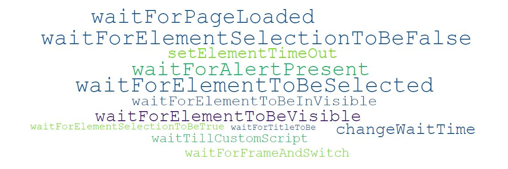

# **Browser Testing** 
-------------------------------------------

The following are the **built-in Actions** within the tool to perform Browser Testing. At any point in time these actions can be modified or enhanced from the engine, based on the project needs.

--------------------------------------------

## Web Elements Actions

There are **24** built-in Actions. 

**Please click the action-cloud below to check the details**

 

--------------------------------------------
## Dropdown Actions

There are **17** built-in Actions. 

**Please click the action-cloud below to check the details**

 

--------------------------------------------
## Dynamic Waits

There are **17** built-in Actions. 

**Please click the action-cloud below to check the details**

 

--------------------------------------------
## Frames and Browser Windows

There are **12** built-in Actions. 

**Please click the action-cloud below to check the details**

 

--------------------------------------------
## Browser/Driver Actions

There are **12** built-in Actions. 

**Please click the action-cloud below to check the details**

 

--------------------------------------------
## Javascript Actions

There are **7** built-in Actions. 

**Please click the action-cloud below to check the details**

 

--------------------------------------------
## Web Table Actions

There are **5** built-in Actions. 

**Please click the action-cloud below to check the details**

 

 --------------------------------------------
## Dynamic Objects Actions

There are **2** built-in Actions. 

**Please click the action-cloud below to check the details**

 

---------------------------------------------

## Assertions

### Element Assertions

There are **8** built-in Actions. 

**Please click the action-cloud below to check the details**

 

-------------------------------------

### Element Text Assertions

There are **12** built-in Actions. 

**Please click the action-cloud below to check the details**

 

-------------------------------------

### Element Attribute Assertions

There are **9** built-in Actions. 

**Please click the action-cloud below to check the details**

 

-------------------------------------

### Browser Title Assertions

There are **9** built-in Actions. 

**Please click the action-cloud below to check the details**

 

 -------------------------------------

### Scroll Assertions

There are **4** built-in Actions. 

**Please click the action-cloud below to check the details**

 

-------------------------------------

### Additional Assertions

There are **8** built-in Actions. 

**Please click the action-cloud below to check the details**

 

