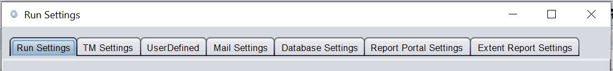
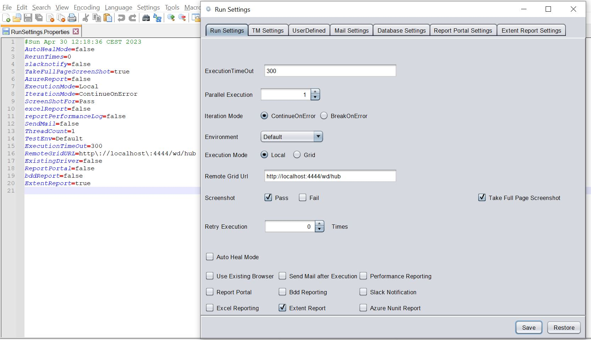
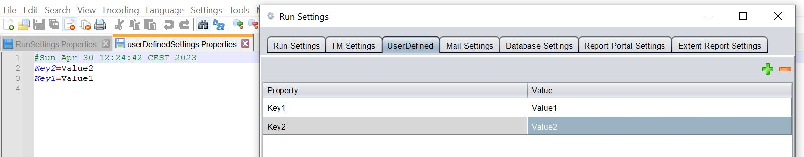

# **Command Line Interface**  
---------------------- 
The tool has a rich set of command line options for execution with parameters, retrieving execution details, setting variables, change settings etc.


|<div style="color:Green;width:100px">Options</div>|<div style="color:Brown;width:400px">Output</div>
|-------------------------------|---------------------------
|`-v`,`--version`               |Display current build details
|`-run`                         |Run with the given details
|`-rerun`                       |Rerun the last execution
|`-project_location` <arg>      |Project Location for Execution
|`-scenario` <arg>              |Scenario Name
|`-testcase` <arg>              |Testcase Name
|`-browser` <arg>               |Browser Name (Not applicable for Testset Execution)
|`-release` <arg>               |Release Name
|`-testset` <arg>               |Testset Name
|`-tags` <arg>                  |Tags of Test Cases to be exceuted
|`-bDate`                       |Display current build date
|`-bTime`                       |Display current build time
|`-bVersion`                    |Display current build version
|`-dont_launch_report`          |Disables launching summary report after execution
|`-help`                        |Help
|`-hi`                          |Says Hello!
|`-t`                           |Display Current Time
|`-latest_exe` <arg>            |Returns the given property value for the latest execution
|`-latest_exe_loc`              |Returns the results folder for the latest execution
|`-latest_exe_status`           |Returns the status for the latest execution
|`-latest_exe_data_loc`         |Returns the Report data location for the latest execution
|`-latest_exe_data_raw`         |Returns the Report data for the latest execution
|`-latest_exe_log_loc`          |Returns the log file location for the latest execution
|`-latest_exe_log_raw`          |Returns the log file for the latest execution
|`-latest_exe_perf_status` <arg>|Returns the page load performance results for latest execution
|`-latest_exe_perf_report` <arg>|Returns the page load performance report for latest execution
|`-checkPagePerf` <arg>         |Returns the page load performance results after Run
|`-setVar` <arg>                |Create/Set user defined variable `[-setVar "var=value"]`
|`-setEnv` <arg>                |Create/Set Env settings <override>
|`-standalone_report`           |Create Standalone Report instead of Relative one

The examples below are shown with **`Run.bat`**, but same set of `cli` options are available for **`Run.command`** to be used in Linux or MAC.

* **Single Test Case Execution**
```shell
Run.bat -run -project_location "Projects\Demo" -scenario "NewScenario" -testcase "NewTestCase" -browser "Chrome"
```

* **Test Set Execution**
```shell
Run.bat -run -project_location "Projects\Demo" -release "NewRelease" -testset "NewTestSet"
```

* **Test Set Execution with specific tags**
```shell
Run.bat -run -project_location "Projects\Demo" -release "NewRelease" -testset "NewTestSet" -tags "@Smoke"
```

* **Test Set Execution with Updated Environment Settings**
```shell
Run.bat -run -project_location "Projects\Demo" -release "NewRelease" -testset "NewTestSet" -setEnv "run.TestEnv=Acceptance"
```
In the above example, the test set will be forced to be executed on `Acceptance` Environment

**`-setEnv`** is a very powerful command to override all the environment settings and userdefined variables.
This can override the values in all of these settings :



Lets look at the `Run Settings` for a Test Set. If we enter into the project location and navigate to the following location :

`Settings\TestExecution\`<`ReleaseName`>`\`<`TestSetName`> 

We will find the `RunSettings.Properties` and the `TestMgmtSettings.Properties` files.

The `RunSettings.Properties` holds all the corresponding settings that we enter via the UI of the tool.



Any of these properties can be overriden by **`-setEnv`**. 

For Example: `-setEnv "run.TakeFullPageScreenShot=False"`

Similarly, if we go to the **project location** and navigate to `Settings\` directory, the `userDefinedSettings.Properties` holds all the corresponding data that we enter via the UI of the tool.



We can use by **`-setEnv`** to override these values too.

For Example: `-setEnv "user.Key1=NewValue1"`

For the following settings, **`-setEnv`** can be used as follows :
|Settings|option|
|--------|-------|
|Global settings| -setEnv "`exe`.SettingName=Value"|
Run Settings | -setEnv "`run`.SettingName=Value"|
User Defined Settings | -setEnv "`user`.SettingName=Value"|
Driver Settings | -setEnv "`driver`.SettingName=Value"|
Test Management Settings | -setEnv "`tm`.SettingName=Value"|

Multiple settings can be altered via a single command as well :

```shell
-setEnv "run.var=value;exe.var=value;user.var=value"
```

