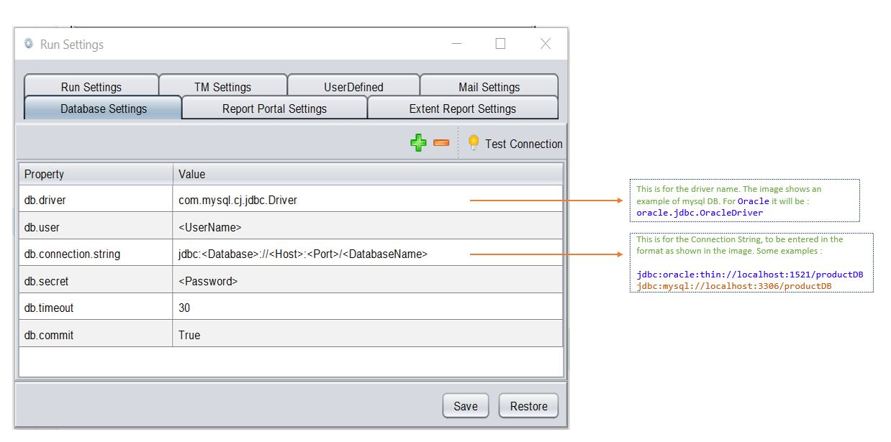
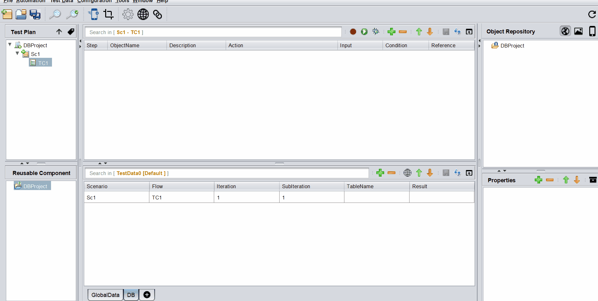
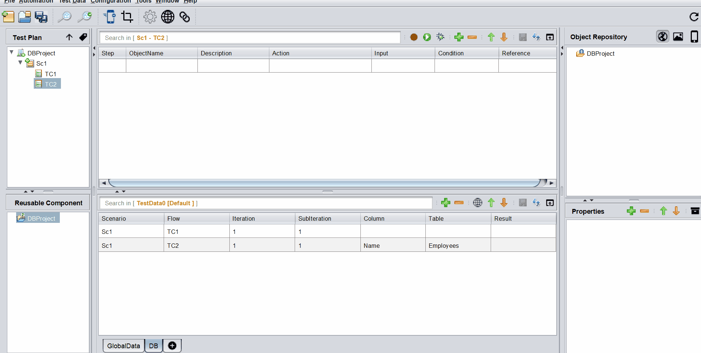
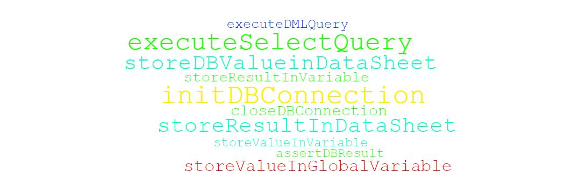

# **Database Testing**
-----------------------------

<span style="color:Green">Database Testing is an important feature of the tool. It allows us to connect to any database and store and assert the results against datasheets.</span>

<span style="color:Green">This gives us an advantage of executing Web, API and Database actions all in one go in a single Test Flow</span>

-----------------------------------

## Set up Database Connection

* Download and store the jdbc driver jar in lib/clib location
- If you are using **mysql** database you need to download `mysql-connector-j-X.jar` from 
[here](https://dev.mysql.com/downloads/windows/installer/).

- If you are using **oracle** database you need to download `ojdbcX.jar` from 
[here](https://www.oracle.com/database/technologies/appdev/jdbc-downloads.html).

        X is the version of your choice


* In order to connect to specific database from tool we need to provide values in **Database Settings** under **Run Settings** of the tool.




**In Java if you were to manually connect, you would invariably use the following :**

```java
Class.forName("com.mysql.cj.jdbc.Driver");
Connection con = DriverManager.getConnection("jdbc:mysql://localhost:3306/productDB", "My_DB_UserName", "My_DB_Password");
```

 ## Query Editor

After the above setting is done, you can proceed with your first steps as shown below.

 

Data Parameterization can be done using the built-in **editor.** If you mouse-hover on the **Input** column, corresponding to the **`DB`** steps, an option to open up the Editor comes up.

 Inside this editor, we can write the `Query` and then parameterize it based on our needs.

 If we press <span style="color:Red">**[ctrl] + [SPACE]**</span>, the list of all available **DataSheets : ColumnNames** along with all **user-defined variables** show up. We can then select the appropriate item from where we want to parameterize.

 We need to press <span style="color:Red">**[esc]**</span> to close the editor

 
 <span style="color:Red">*The above image is a gif. So if its not moving, please reload the page*</span> 


 ## Actions

 There are **11** built-in Actions. 

<span style="color:Red">**Please click the action-cloud below to check the details**</span>

 [](dbActions/dbActions.md)