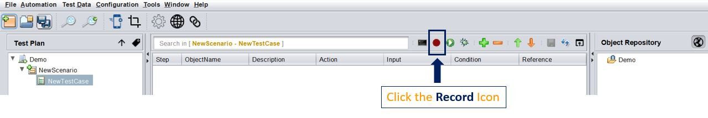
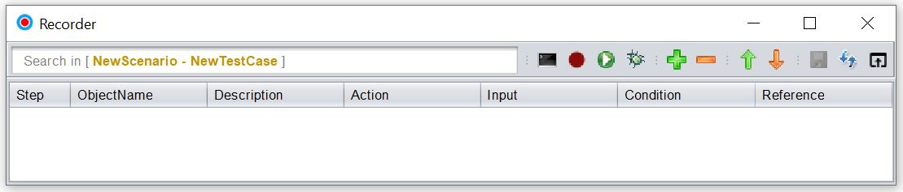
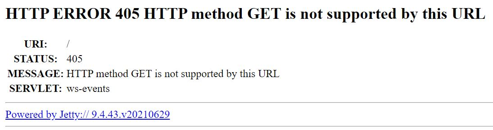

# **Getting Started**

## Prerequisites
-----------------------
#### Hardware Requirements

 * RAM: Min. 2GB (preferably 4GB)
 * Operating System: Windows (32/64 bit)/ MAC OS/Linux

*The tool is built on Java. Hence it will work on any Operating System which supports Java.*
 
#### Software Requirements

 * Java 11 or above
 * For customizations, any IDE which supports Java Development (eg. Eclipse, Netbeans, etc.)

## Installation
-----------------------
* **Step 1** : Download the Latest version of the tool [from here](https://github.com/CognizantOpenSource/Cognizant-Intelligent-Test-Scripter/releases/download/v2.0/cognizant-intelligent-test-scripter-2.0-setup.zip).  

 

* **Step 2**: Extract the zip, into a directory of your choice. **The tool as such does not require any "installation" process. Simple extraction of the zip file is enough.**

 

* **Step 3**: If you are using the tool for Browser Automation, then please ensure that you download and update the appropriate **driver** in the `lib\Drivers` location where your tool is present.

For example if you are using `Chrome`, then check the version of the browser installed on your machine from  `Help` > `About Google Chrome` option. You need to download the **same driver version as the browser version.**
So, if you see the version as `112.0.5615.138 (Official Build) (64-bit)` then you need to download Chrome Driver `112.x`. You can do so from [here](https://chromedriver.chromium.org/downloads). Once downloaded, unzip it in the the `lib\Drivers` location where your tool is present.

 

* **Step 4**: For `Record`, `Spy` and `Heal`, you need the browser extention of the tool. From chrome webstore, add the tool extension in your browser. You can directly navigate to this [link](https://chrome.google.com/webstore/search/cognizant%20intelligent%20test%20scripter) and add it. Make sure to pin the extension so that you can use it easily.  

 

* **Step 5**: To launch the tool, follow the following step(s) :

1. For *Windows*: Double Click the `Run.bat` in the tool location
2. For *Mac*: Open Terminal in the installation location and then type `chmod +x Run.command`. Then Double Click the `Run.command`. If you see It's Downloaded From Internet Warning then enter the following command in terminal `xattr -d -r com.apple.quarantine /path/to/the tool`

## Start with Recording
-----------------------

The easiset and quickest way to get underway with automation is to record a user journey in the A.U.T. (Application Under Test). To do so, follow the steps below :

* **Launch the tool**:  Double Click the `Run.bat` [Windows] or `Run.command` [Mac]

 

* **Launch the recorder**: Click the `Record` icon

The `Recorder` should open up

 

* **Connect to the extension**: Click the `Browser Extension` **while having the recorder launched**. The extension should show a **Green colored [R]** indicating that Recorder mode is **[ON]** 

* **The extension should look like this** : 

 

----------------------------
**NOTE :**

If you get is an `Error in connection` or no response after clicking the extension, follow the following steps :

1. Hit the following URL  **while having the recorder launched** : `https://localhost:8887/`
2. Click on `Proceed`
3. You should get a message like this 

4. Now Repeat the steps explained in **Connect to the extension** step.

----------------------------

<!-- ## Recording Example
-----------------------

* **Step 1** : Open `https://www.ing.com/`
* **Step 2** : Navigate through the **Menu** items like `Home`, `About us`, `Profile`
* **Step 3** : Click and enter into the `ING at a glance` page and validate the **Page Heading**
* **Step 4** : Enter into the `Contact us` page and **fill out the form**

*The above image is a gif. So if its not moving, please reload the page*-->

-----------------------
