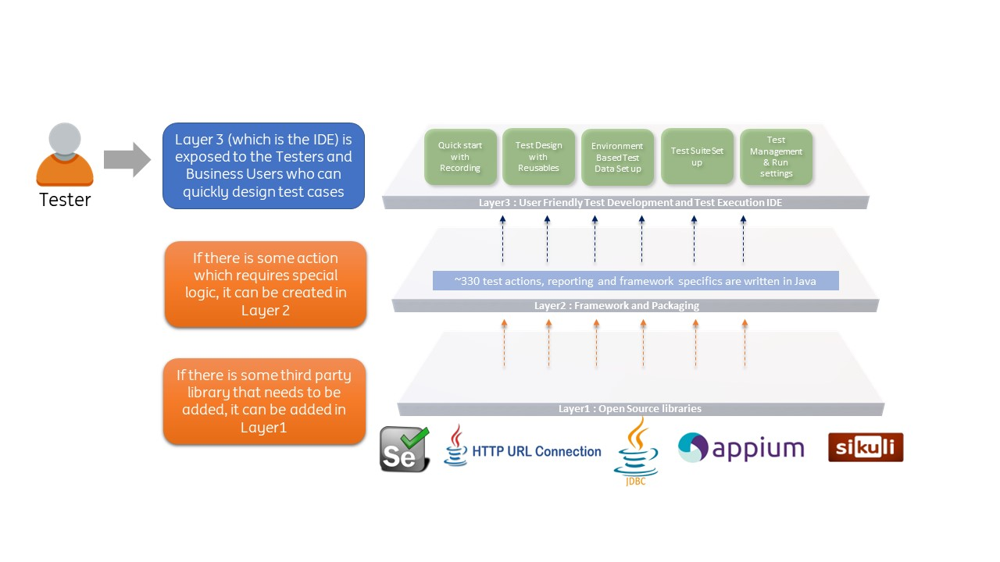

# **Introduction**

 

 
 CITS is an `open-source` no code/low code test automation solution that provides a unified interface for all the **agile** test automation activities such as :
 * **test design** 
 * **test development** 
 * **test execution** 
 * **reporting** 
 * **maintenance**

 

## At a Glance
-----------------------

|
Browser Testing
| 
API Testing
| 
Database Testing
   		| 
WebPage Performance
        | 
Layout & Accessibility Testing
                 | 
Image Based Testing
    |
|-------------------------------------|-----------------------------|---------------------------|------------------------------------|--------------------------------|------------------------|
|Uses `Selenium`                      |Uses java `HttpURLConnection`|Uses `JDBC Driver`    		|`Page` and `Resource` timings report|Uses `GalenFramework` for Layout Validations		  | Uses `Sikuli`          |
|`~280` built-in actions              |`~25` built-in actions		|`~15` built-in actions		|Har Compare						 |Creates PageDump				  | Image comparisons      |
|`Local` and `Selenium Grid` execution|Easy Data parameterisation	|Easy Data parameterisation |Har Comparison Report					 |Auto-suggests Layout Validations | Image Text Extractions |
|Parallel Execution					  |	Parallel Execution							|							|CLI support for Report				 |Uses `aXe` for Accessibility Tests            | Image Text Validations |

##  Integrated Development Environment (IDE)
-----------------------
* Easy to get started with build-in `record`, `spy` and `heal` features

* Quick creation of test flow scaffoldings and boilerplate reusables

* Reusable components block for **reusing scripts**

* Intuitive **Test-data parameterisation**  

* Environment-based test-data set up and execution (Example: `DEV`, `TEST`, `ACCEPTANCE`) 

* Built-in Dynamic Data creation actions

* Platform independent - Can be used in any operating system supporting java, like **Windows**, **MAC**, **Linux**

##  Integrated BDD 
-----------------------
* Built-in `Gherkin` editor for writing **feature files**

* Imports **feature files** to generate the corresponding Test scenarios, `Step Definition` scaffoldings and Test Data

* Generates BDD style reporting afetr execution

##  Azure DevOps  
-----------------------

* Rich **command line interface** to run test cases and pass propeties and variables at run time

* Easy to add `cli` execution commands to Azure DevOps YAML files 

* Generates **Nunit** report which shows the test results (including `execution logs`, `screenshots`, `request payloads`, `response payloads` directly in Azure DevOps)

* Seamless integration into **Azure DevOps Test Plans** to report back the execution status in the Test Plan

* Execute failed testcases in a test set automatically after a run

##  Customization  
-----------------------

* Addition of new methods for project specific requirements is possible through the `Engine` project

* Enhancing an built-in method is also possible through the same way

* Incorporation of external libraries is also possible

## Architecture
-----------------------

## Comparisons and Limitations
-----------------------

Click [here](https://cognizantopensource.github.io/Cognizant-Intelligent-Test-Scripter/comparison/) to read about the Comparisons with industry standard frameworks and also the limitations of the tool.

