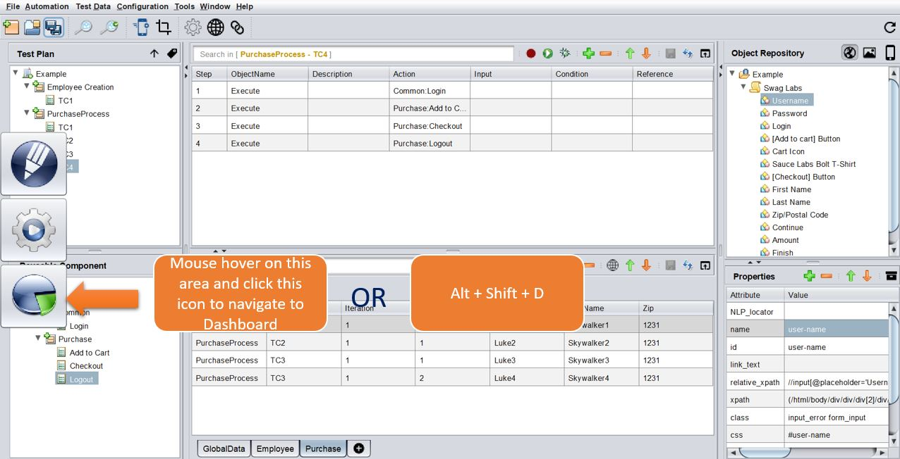

# **Know The Tool**  
-----------------------------------

## Menu Ribbon

### **1. Tools**


### **2. Execution**

 

 -------------------------------------

 ## Test Design Pane

 This is where the test cases are designed and debugged. On opening the tool, the user by default lands on this pane.

 

 **The Design Pane is composed of the following 5 components :**

 ### **1. Test Plan**

 This where the Test Scenarios and Test Cases are created and organized.
 Every `Scenario` in the tool's UI , is a `Directory` in the backend and every `Test case` is a `.csv` file.

 To see this, you can navigate to the location of your tool, then `Projects` >> `Your Project` >> `Test Plan`

 

 If you select a Scenario or Test Case and **Right Click**, you will have some interesting and handy options to work with :

 

 -------------------------------------

 ### **2. Reusable Components**

 This where the **Reusable** Test Scenarios and Test Cases (**logical grouping of test steps**) are created and organized. Every `Scenario` in the tool's UI , is a `Directory` in the backend and every `Test case` is a `.csv` file.

 To see this, you can navigate to the location of your tool, then `Projects` >> `Your Project` >> `Test Plan`

 

 What differentiates the Scenarios and Test Cases in the Test Plan compared to those in the Reusable Component is the purpose :
 * **Test Plan** is supposed contain Functional/Regression/E2E/Business Test Cases
 * **Reusable Component** is supposed contain logical test step groupings, to be used in multiple test cases in the test plan.

 The tool makes use of the **`ReusableComponent.xml`** located in the Project Location, to differentiate between the above 2 type :

 Here is the `ReusableComponent.xml` for the above example :

 ```xml
<Root ref="Example" type="RC">
	<Folder ref="UI">
		<Scenario ref="Common">
			<TestCase exeType="Executable" ref="Login"/>
		</Scenario>
		<Scenario ref="Purchase">
			<TestCase exeType="Executable" ref="Add to Cart"/>
			<TestCase exeType="Executable" ref="Checkout"/>
			<TestCase exeType="Executable" ref="Logout"/>
		</Scenario>
	</Folder>
</Root>

 ```

 If you select a Reusable Scenario or Reusable Test Case and **Right Click**, you will have some interesting and handy options to work with :

 

 -------------------------------------


  ### **3. Test Steps**

  This is the canvas where you have your test steps in sequential order

  

  To make working simple, intuitive and easy, you can also use the **drag and drop** to create test steps.

  In the following example, we can create the *Checkout* Reusable simply by **dragging and dropping the objects** from the Object Repository and parameterizing them by **dragging and dropping the datasheet columns**

  
  <span style="color:Red">*The above image is a gif. So if its not moving, please reload the page*</span>

  As a best practice, it is advisable to compose your test case **only with Reusables** and not have any loose (orphan) steps.

  You can also drag and drop the Reusables to create test cases like this :

  
  <span style="color:Red">*The above image is a gif. So if its not moving, please reload the page*</span>
   
   
   -------------------------------------

### **4. Test Data**

This is the area where you can set up your test data in multiple sheets.

 

#### Set up Multiple Environments

To set up environment based execution, you can set up mutiple environments following the 5 steps as below :

 

 * **Step 1** : From **Test Data** >> Make sure **Multiple Environments** is selected
 * **Step 2** : Click the **[+]** icon in the Data Section, to add a new Environment
 * **Step 3** : Enter the [Environment] Name
 * **Step 4** : Check **[Copy Data from Other Environments]**
 * **Step 5** : Select the Environment and the corresponding Data sheets to be copied and then click **[Create] Button**


-----------------------------------

If you select a data cell and **Right Click**, you will have some interesting and handy options to work with :

 

------------------------------------ 

### **5. Object Repository**

This is the area where the Web Elements/Objects are present along with the multiple attributes/properties to be used to find that element on the Application.

    If any of the properties gets changed or updated in the application, the tool will try 
    to use the next property in the list to identify and loop through the entire list, till 
    it finds a unique match. 

 
 
 If you select a Property and **Right Click**, you will have some interesting and handy options to work with. These options are applicable to used for :

 * Selected Object
 * All objects in the Page
 * All Objects in the OR 


 

------------------------------------ 

## Test Execution Pane

 

In this pane we can club our test cases together into logical *test sets* or *test suites* and execute them - Either locally or via a CICD pipeline.

 

 * **Step 1** : Right Click on the Project Name >> **Add Release** >> Right Click on the Release Name >> **Add TestSet**
 * **Step 2** : Select the test cases that you want to add to the set. You can do individual selections or bulk selection by simply selecting the entire Scenario. Once selected, click on the <span style="color:Green">**Green <--- Arrow**</span> to pull your selections into the set.
 * **Step 3** : Order the Test Cases in the sequence of your choice. Choose the appropriate Browsers.
 * **Step 4** : Click on the **gear icon** and open up the **Run Settings**. Here you can configure many settings like :
    * Parallel Thread count
    * Execution Mode as Grid or Local
    * Which Environment to pick for execution

Once done, we are good to start our execution by clicking on the <span style="color:Green">**Green Play/Run button**</span>

------------------------------------ 

## Dashboard Pane

 

In this pane we can view the detailed summary report and even access historical individual reports.

The **Detailed Summary Report** tab looks like this :


The **Latest Summary Report** tab looks like this :

