# **Some Tips and Tricks**

----------------------------------

## Execution TimeOut

#### Handling Execution Timeout Of Test Sets

The tool provides an option to set the **Execution timeout** of the test sets run from the execution panel. The default execution timeout is 300minutes (5 hours).

#### When Is It Useful?

Suppose, you have a test set containing 100 test cases and it takes 7 hours to execute all the test cases. As the default execution timeout is 5 hours, the test set will run for the 5 hours and remaining test cases yet to run will be marked as **NoRun**. Increasing the timeout will help in executing the full set.

#### How Is It Done?

To set the execution timeout, go to **Configuration->Run settings**

* Click the **Run settings** tab and set the execution timeout to the desired value.

        Note: The execution timeout must be given in minutes

* Click **Save**.
 
> **Note**: To save the settings for the individual test sets, click on the test set and open the Run settings to save or use the **Quick settings** option in the execution panel

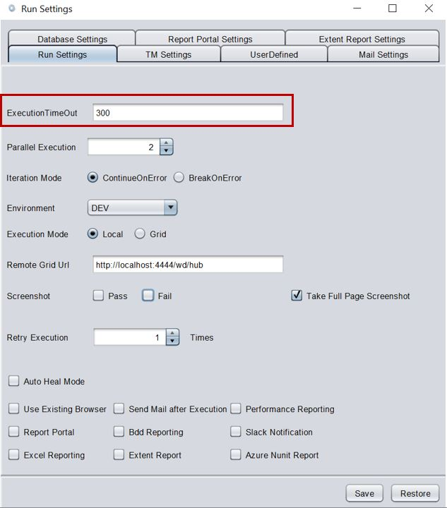

 * To check if the settings have been saved, go to 

 **Projects->Project name->Settings->TestExecution->Release name->Testset name** and open the **RunSettings** file to view the settings.

 * If there are multiple test sets, the execution timeout must be set individually for each set. 

---------------------------------------

## Full Page Screenshots

#### Why The Browser Scrolls Up And Down At Certain Steps In The Application

While executing the test scripts, you might have observed that sometimes the browser scrolls up and down in a particular page in the application under test.

This might eventually increase the execution time of your scripts as well. The browser scrolls up and down in order to take full page screen shots of the current application page.

#### How to stop the browser from scrolling while execution?

If it is not required to take full page screen shots, you can disable full page screenshots by following the steps –

 * Navigate to **Configurations -> Run Settings**

 * Uncheck the check box for “Take full page screen shots”, under **Run settings** tab.

 * You can also enable/disable the screenshots for the PASS or FAIL steps bychecking/unchecking the **Pass** or **Fail** checkboxes respectively

 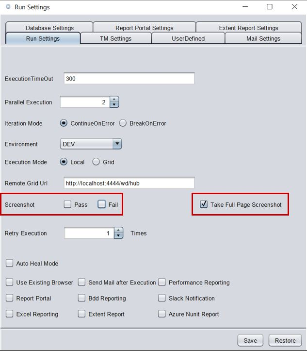

-------------------------------------

## Global Data Sheet

#### What is Global Data sheet?

Global Data sheet is used to contain data that can be used across multiple data sheets (for example application URL, API endpoints etc).

#### How To Use Global Data Sheet?

For every project that is created, a default global data sheet is generated.

#### Where to use the Global Data?

Identify the Data column name which is common across multiple data sheets.

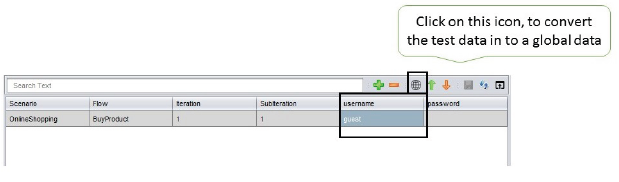

Select that data value and click on **global data** icon, as shown in the image above.Give the global data id, in the respective window, as shown below,

You will get the global id in the global data sheet, as shown below.

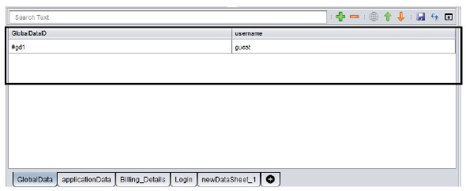

-----------------------------------

## Impact Analysis

#### Impact Analysis At Object, Flow And Test Data Level

The tool has a feature to get the list of **impacted testcases**, if there is any change in the object properties, reusable component or in testdata sheet. User can quickly validate the change by running the test cases which are impacted.

#### How To Perform Impact Analysis?

**Object Level** 

 * In the Object Repository, right-click the modified object and select the option **Get Impacted TestCases**.

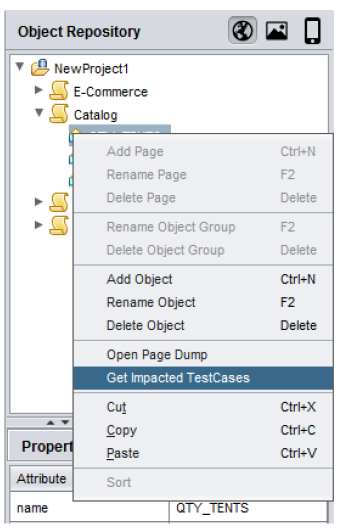

 * In the Impacted TestCases dialog box, the list of impacted test cases will beshown. Select the required test cases and click **Create as TestSet** Now a new testset will be created.

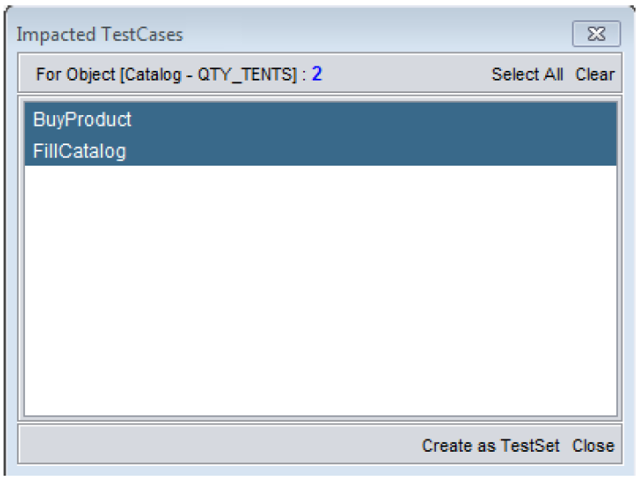

 In the Execution panel, you can see the newly created test set under the releasename. The test set will contain the selected test cases and reusables that havebeen affected due to the modifications done to that object.You can rename the testset accordingly.

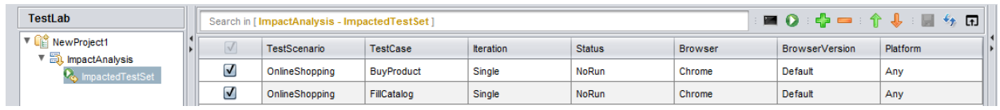

 *  Now, select the test cases that you wish to run and click the **run **button.

**Flow Level**

 * In the Reusable Components section, right-click the modified reusable and selectthe option ‘**Get Impacted TestCases**’.

 !

 You can create a new Test Set containing the required Test cases and run thesame from the Execution Panel.

**Test Data Level**

• In the Test Data section, right-click the modified data sheet and select the option ‘**Get Impacted TestCases**’.

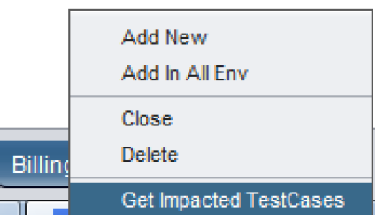

• You can create a new Test Set containing the required Test cases and run the same from the Execution Panel.

-------------------------------------------

## Object Property Hierarchy

#### Setting Object Property Hierarchy at Project, Page and Object Level

You can change the priority of properties of a web element based on which, elements are identified at Object, Page and Project level in the Object Repository.

#### Why is it needed?

* Any object property, by which we can identify the object uniquely can be set at high priority to reduce the time taken to identify the object on the Web application.

* Instead of setting the property hierarchy for each object individually, the hierarchy can be set at the project or the page level. As a result all the objects within the same page or project will follow the same property hierarchy, enabling easy identification of objects.

#### When will it be useful?

If the objects **id/name** is dynamic in nature, we can set the object priority to relative **xpath/CSS** to identify the object.

#### How can we implement it?

*  To change priority at **Object level** , select an Object in Object Repository then in the object properties table shuffle the attributes using **Up arrow or Down arrow**. Now the object will be identified using the changed the property attribute.

* To change priority at **Page level**, set the property hierarchy in the Properties pane.Then, right click, go to
**Set Priority** and select the option **Set Priority to Page** . Now all the objects within the page will follow the same hierarchy.

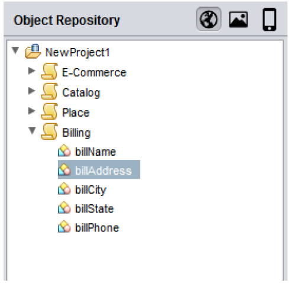

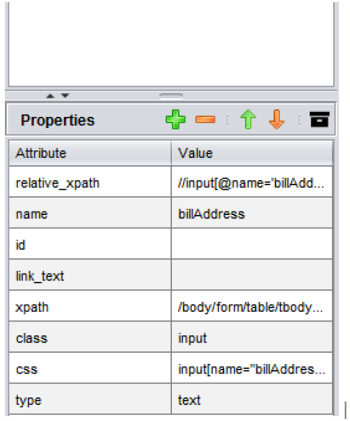

* To change priority at **Project level** , set the property hierarchy in the Properties pane. Then, right click, go to **Set Priority** and select the option **Set Priority to All** .Now all the objects within the project will follow the same hierarchy.

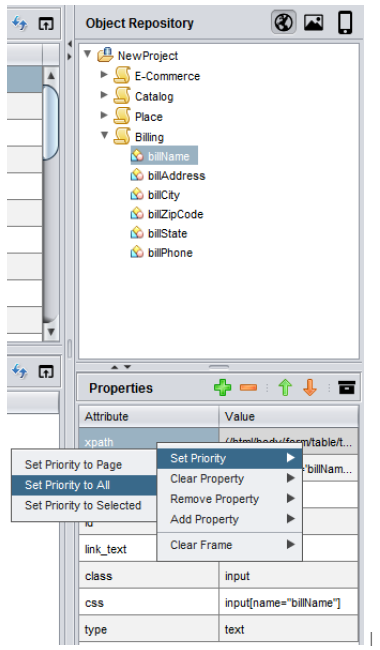

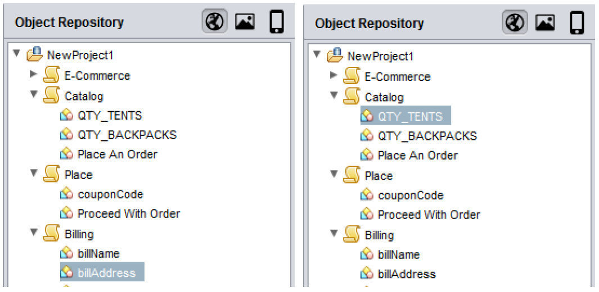

* To change priority for **selected objects** , select the objects and set the property hierarchy in the Properties pane. Then, right click, go to **Set Priority** and select the option **Set Priority to Selected** . Now the selected objects will follow the same hierarchy.

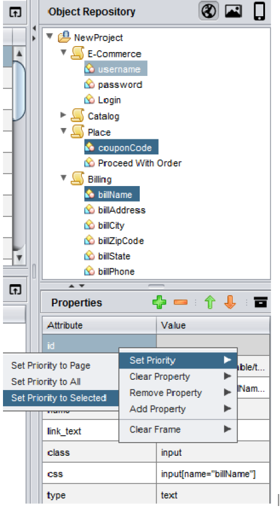

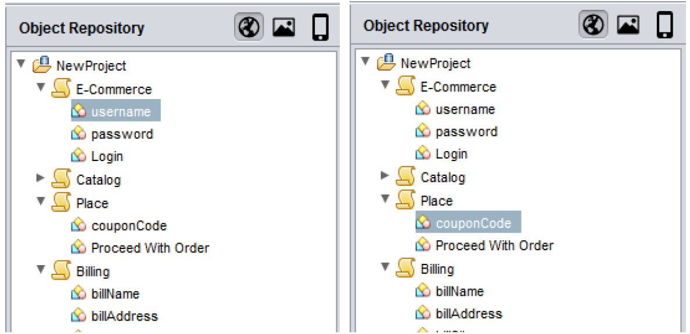

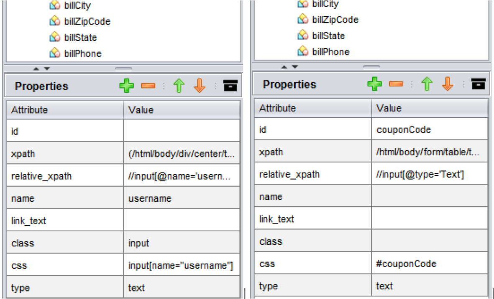

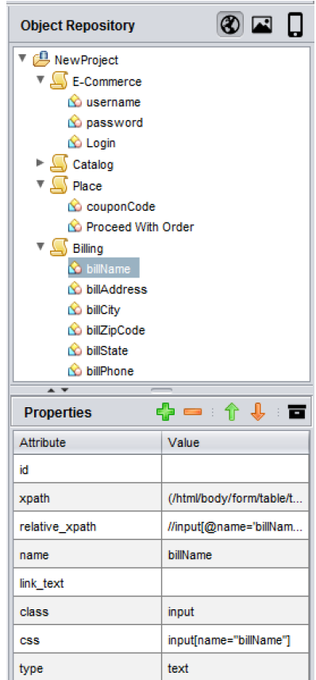

------------------------------------------

## Rename and Refactor

The tool comes with an option to rename and refactor the object, test case, data sheet and reusable component names

Consider the example, given below,

* I want to refactor the object **billName**.

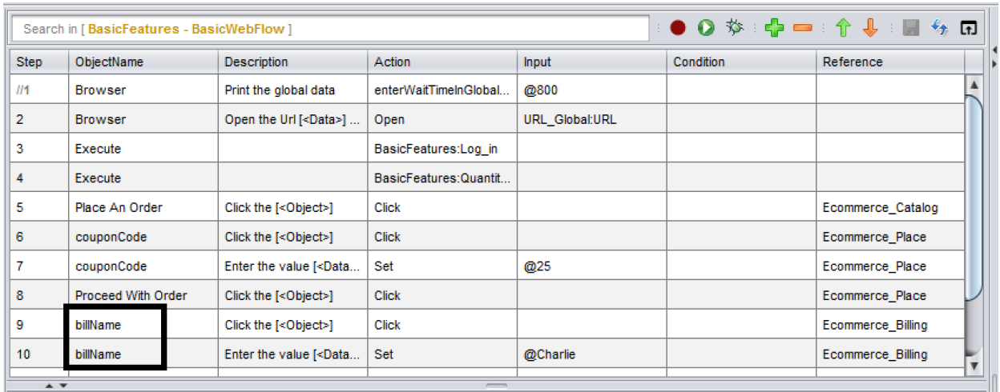

* Go to the Object Repository section, select the object and perform a right click. Choose **Rename Object** or press **F2**

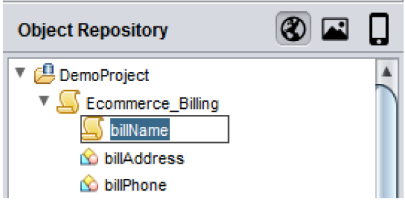

* The object gets refactored automatically in all the locations, wherever it is used

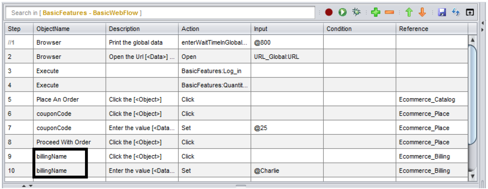

* The same procedure can be applied to test cases, test data sheets and reusable components as well.

----------------------------------

## Report Sharing

#### Not Able To View Reports Properly When Shared?

When you run any script from design or execution panel, the reports will be availablein the location,**<installation location>\Projects\\Results**.

If you just share the **.html** files, your report will open as shown below,

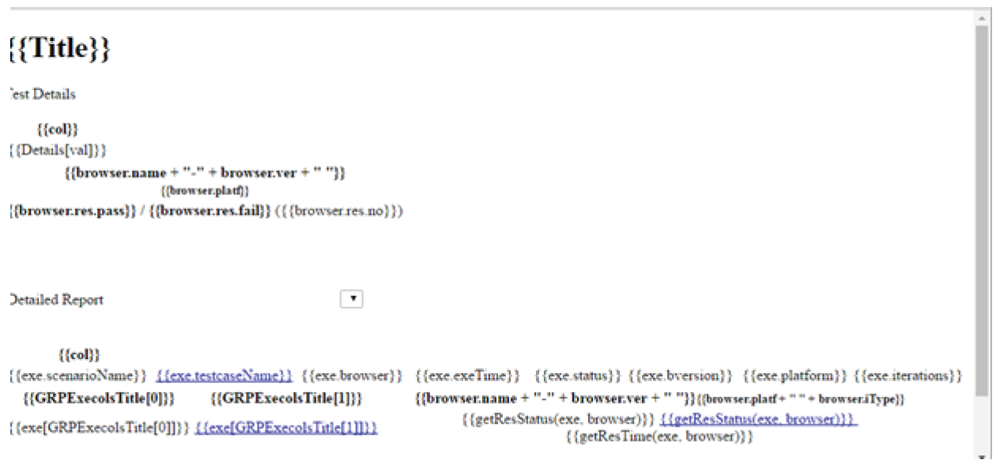

This is because of the absence of the media folder found in the **<installationlocation>\Projects\<your project>\Results location**. The media folder contains allthe necessary **js, css** and other files required to present the report file.

So ensure that you share the entire results folder found in the location **<installationlocation>\Projects\<your project>\Results**. You can compress and share the zipped file.

You can also create standalone reports for the test cases or test sets. Before execution, go to **Configurations->Options** and enable the **Create Standalone Report** checkbox. After execution, the reports created will be standalone and can be sharedindependently without the Results folder.

----------------------------------

## Use Existing Browser

#### Use Case:

If you want to run all the test cases in your test set in one session in the same browser in which the first test case is configured, then you can use this option.

#### How To Use:

**Create a test set in the execution panel**

*Choose the browser name for the first test case alone, which is Chrome in the image below, the default browser for the other test cases will be Firefox

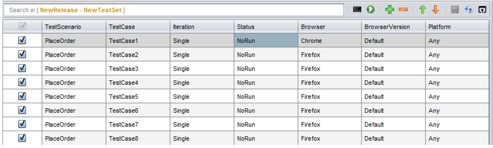

* With the test set selected on the left (Test Suite section), navigate to

**Configuration>Run Settings**

* In the Run settings window, check the option Use Existing Browser and click on Save

* Now when you run the test set, all your test cases will be executed in the browser configured for the first test case in the test set in one session, irrespective of the browser names configured for the rest of the test cases.

> **NOTE:** This option is not applicable for parallel execution

------------------------------------------------------

## User Defined Variables

You can create a user defined variable and use the variable to access data in multiple test cases.

#### When Will It Be Useful?

This feature really comes in handy when you have to use the same data across multiple test cases.

If you are using global data sheet to pass data which is common to various testcases, you will have to map the data in the global data sheet to test data sheets of the respective test cases, which is a bit cumbersome.

If you are using the user defined variable, you can directly pass the variable value to the test case i.e. mapping the data to the test data sheets in respective test cases can be skipped.

#### How To Pass The Data To Your Test Case Using The User Defined Variable?

Suppose in all your test cases that you create, you first navigate to a particular URL and then perform your row, you can hard code the URL to all you test cases as shown below.

**Please note** there might be some cases where the URL is environment dependent i.e. the URL is different for different environment. In that case you will have to go to each and every test case in your project and change the URL in all the test cases manually.

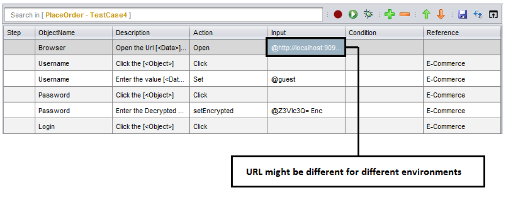

These issues can be eliminated by using user defined variables to pass the common data (URL in this case)

**To create a user defined variable?** 

Go to **Configurations -> Settings -> UserDefined**

Add the variable and pass the value 

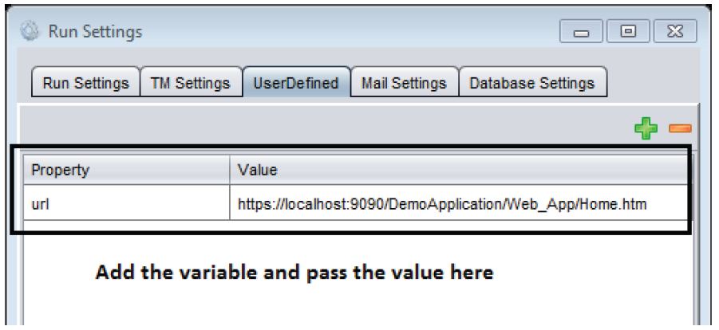

Now, you will be able to use the variable inside your test case as shown below

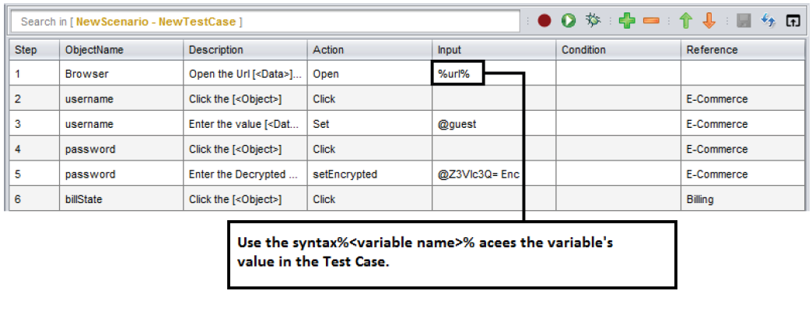

If you wish to run the test case in different environment now, you can simply change the value for the user defined variable and the change will be reflected in all your test cases where the variable is used.

