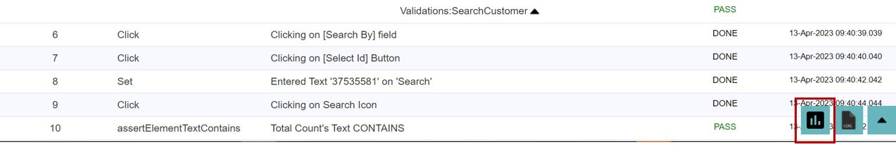

# **WebPage Performance Testing**
---------------------------------------

<span style="color:Green">We can analyse the performance of a Web Page by using some built-in actions. The tool generates an **information-rich performance report** which is very handy to visualize which resource consumed how much time.</span>

<span style="color:Green">Additionally, there is an option to **compare HAR files** and even set benchmarks.</span>

<span style="color:Green">HAR is the short form for HTTP ARchive format, which tracks all the logging of web browser's interaction with a site. HAR files can be a requirement for troubleshooting issues specifically for problems such as performance and page rendering.</span>

------------------------------------------------
## Actions

### **capturePageTimings**

**Description**: This action captures page navigation and resource timings parameters of the web page last opened or navigated to and stores it in the Performance Report and HAR file.

**Input Format** : @PageName

**Usage**

| ObjectName | Action | Input        | Condition |Reference|  |
|------------|--------|--------------|-----------|---------|--|
| Browser     |*capturePageTimings*   | @value       |       | PageName|<span style="color:Green"><< *Hardcoded Input*</span> 
| Browser     |*capturePageTimings*   | Sheet:Column |       | PageName|<span style="color:Blue"><< *Input from Datasheet*</span>
| Browser     |*capturePageTimings*   | %dynamicVar% |       | PageName|<span style="color:Brown"><<*Input from variable*</span>

**Internally uses:**

```javascript
    var pt=performance.timing;
    var t={};
    t.title=document.title;
    t.url=window.location.href;
    for(var k in pt){t[k]=pt[k];}
    t.toJSON=undefined;
    return JSON.stringify(t);
```
-----------------------------------------


### **ClearCache**

**Description**: Clears browser's data, for example cookies.

**Usage:**

| ObjectName | Action        | Input        | Condition |Reference|
|------------|---------------|--------------|-----------|---------|
| Browser    |*ClearCache*   |              |           |         |

**Corresponding Code:**

```java
@Action(object = ObjectType.BROWSER, desc = "To delete all the cookies", input = InputType.NO)
    public void ClearCache() {
        try {
            Driver.manage().deleteAllCookies();
            Report.updateTestLog(Action, "Cookies Cleared", Status.DONE);
        } catch (Exception e) {
            Report.updateTestLog(Action, "Failed to clear cookies", Status.DONE);
        }
    }
```

---------------------------

## Create HAR files 

 * Use the action **`capturePageTimings`** on strategic pages

 * Navigate to **Configuration>Run Settings** and check the **Performance Reporting** check box under the **Run settings tab**.

 

 * Once this configuration is saved, run your test set and post the execution you will get a report.Expand the report by clicking on your test case and this time the **console** icon on the bottom right will change into the **Performance Report icon**.

 * To launch the **performance report** click on the **Performance Report icon**.


 

 * The table and graph view contains the **har** files generated post execution.Click on them to get the various **page and resource timings parameters** captured by the **capturePageTimings** action.


---------------------------

## Compare Har Files

* To Compare your **Har** files, navigate to **Tools>Har Compare** and you will be redirected to the **Har Comparator** site.


* Here you compare the **Har** files that you have in your project.


* You can and also set **benchmarks** for achieving standards.

